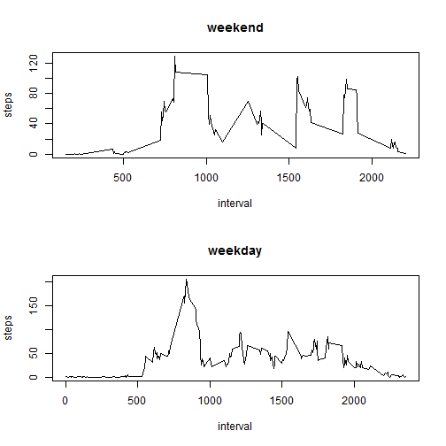

# Reproducible Research: Peer Assessment 1


## Loading and preprocessing the data

```r
ds <- read.csv("data/activity.csv")
```

## What is the mean total number of steps taken per day?

* Make a histogram of the total number of steps taken each day


```r
### aggregate data
steps_date <- aggregate(steps ~ date, data=ds, FUN=sum)
### plot data 
barplot(steps_date$steps, names.arg=steps_date$date, xlab="date", ylab="steps")
```

 

* Calculate and report the **mean** and **median** total number of steps taken per day


```r
# get mean
mean_steps_day <- mean(steps_date$steps)
mean_steps_day
```

```
## [1] 10766
```

```r
# get median
median_steps_day <- median(steps_date$steps)
median_steps_day
```

```
## [1] 10765
```

## What is the average daily activity pattern?

* Make a time series plot (i.e. type = "l") of the 5-minute interval (x-axis) and the average number of steps taken, 
   averaged across all days (y-axis)


```r
steps_interval <- aggregate(steps ~ interval, data=ds, FUN=mean)
plot(steps_interval, type="l")
```

 

* Which 5-minute interval, on average across all the days in the dataset, contains the maximum number of steps?


```r
steps_interval$interval[which.max(steps.interval$steps)]
```

```
## Error: object 'steps.interval' not found
```

## Imputing missing values
* Calculate and report the total number of missing values in the dataset (i.e. the total number of rows with NAs)


```r
steps_total_missing_vals <- sum(is.na(ds))
```

* Devise a strategy for filling in all of the missing values in the dataset. The strategy does not need to be sophisticated.         For example, you could use the mean/median for that day, or the mean for that 5-minute interval, etc.

This project will use the mean of the 5 minute interval.

* Make a histogram of the total number of steps taken each day and Calculate and report the mean and median total number of steps taken per day. Do these values differ from the estimates from the first part of the assignment? What is the impact of imputing missing data on the estimates of the total daily number of steps?


```r
ds2 <- merge(ds, steps_interval, by="interval", suffixes=c("",".y"))
nas <- is.na(ds2$steps)
ds2$steps[nas] <- ds2$steps.y[nas]
ds2 <- ds2[,c(1:3)]
```

* Make a histogram of the total number of steps taken each day and Calculate and report the mean and median total number of steps taken per day. Do these values differ from the estimates from the first part of the assignment? What is the impact of imputing missing data on the estimates of the total daily number of steps?


```r
### aggregate data
steps_date <- aggregate(steps ~ date, data=ds2, FUN=sum)
### plot data 
barplot(steps_date$steps, names.arg=steps_date$date, xlab="date", ylab="steps")
```

 

```r
# get mean
mean_steps_day <- mean(steps_date$steps)
mean_steps_day
```

```
## [1] 10766
```

```r
# get median
median_steps_day <- median(steps_date$steps)
median_steps_day
```

```
## [1] 10766
```

The missing data does not have a big impact on the plot or the mean and median. 

```

## Are there differences in activity patterns between weekdays and weekends?

* Create a new factor variable in the dataset with two levels -- "weekday" and "weekend" indicating whether a given date is a weekday or weekend day.


```r
#set language for date 
Sys.setlocale("LC_TIME", "English")
```

```
## [1] "English_United States.1252"
```

```r
daytype <- function(date) {
    if (weekdays(as.Date(date)) %in% c("Saturday", "Sunday")) {
        "weekend"
    } else {
        "weekday"
    }
}
ds2$daytype <- as.factor(sapply(ds$date, daytype))
```

* Make a panel plot containing a time series plot (i.e. type = "l") of the 5-minute interval (x-axis) and the average number of steps taken, averaged across all weekday days or weekend days (y-axis). The plot should look something like the following, which was creating using simulated data:


```r
# subset data
dssub_weekend <- subset(ds2, ds2$daytype=="weekend")
dssub_weekday <- subset(ds2, ds2$daytype=="weekday")      

par(mfrow=c(2,1))
for (type in c("weekend", "weekday")) {
    steps_type <- aggregate(steps ~ interval,data=ds2,subset=ds2$daytype==type,FUN=mean)
    plot(steps_type, type="l", main=type)
}
```

 
